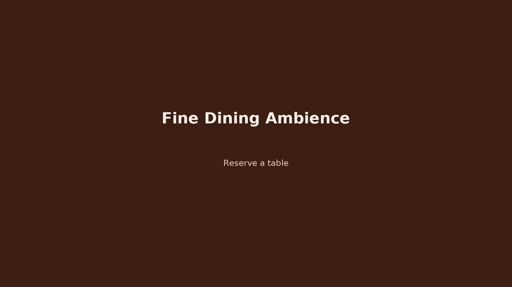

# 🍽️ Mautamu Delicacies

A visually stunning **restaurant landing page** inspired by a premium furniture layout from Figma, fully adapted to a **warm, elegant dining theme**.  
The design combines **luxury 5-star appeal** with **local authenticity** — evoking the true “Mautamu” experience.

---

## 🖼️ Preview



---

## 🌟 Features

- 🍛 **Hero Section** — Warm, appetizing hero image with brand tagline and CTA button.  
- 🧾 **Menu Section** — Highlights signature meals and new additions with dynamic cards.  
- 🪑 **Product Carousel** — Showcases multiple dish sets in a sliding gallery.  
- 💬 **Testimonials** — Customer reviews with profile images and quotes.  
- 📩 **Subscription Footer** — Collects emails for offers and newsletters.  
- 🌙 **Dark Mode Design** — Deep warm tones with golden highlights for a classy aesthetic.  
- 📱 **Fully Responsive** — Looks great on mobile, tablet, and desktop.

---

## 🛠️ Tech Stack

| Stack | Technology |
|-------|-------------|
| Frontend | React + Vite |
| Styling | Tailwind CSS |
| Animation | Framer Motion |
| Icons | Lucide React |
| Fonts | Google Fonts (Poppins & Inter) |
| Images | Unsplash curated set |

---

## 📦 Project Setup

### 1️⃣ Clone Repository
```bash
git clone https://github.com/Nextofkins/mautamudelicacies.git
